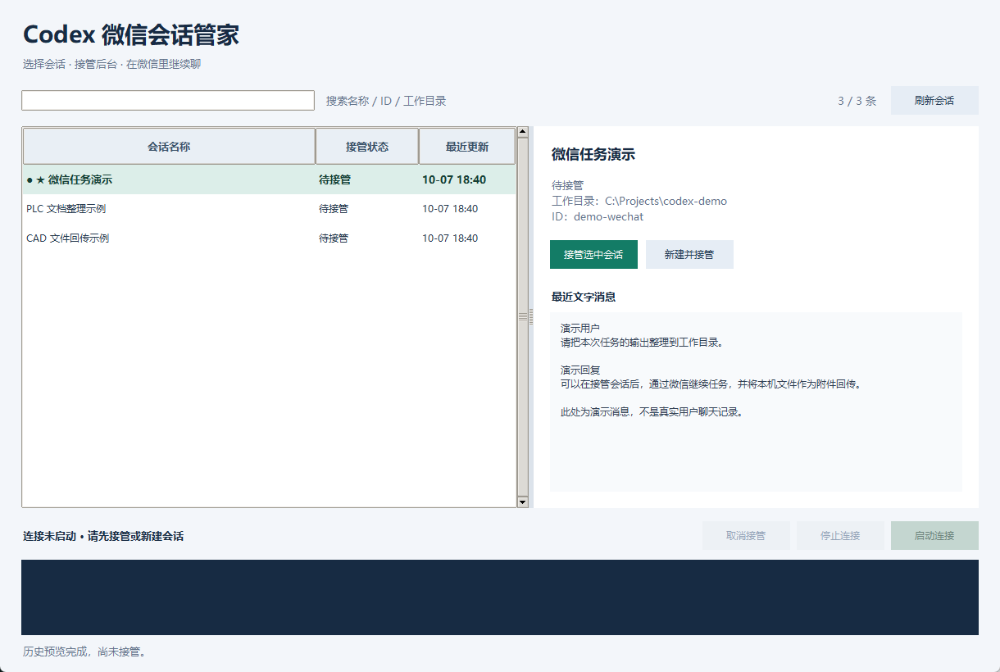

# Codex 微信会话管家

一个面向 Windows 个人使用的轻量工具：在电脑上选择 Codex 会话，通过微信官方 iLink 的 AI 聊天入口继续下达任务，并接收回复和本机文件。

它把会话选择、接管和连接启停放进一个窗口，减少反复操作命令行的步骤。接入的是带 AI 标识的微信聊天入口；实际回答与任务执行由本机 Codex 完成。



> 截图使用演示会话和演示消息，展示实际界面布局，不包含真实用户聊天记录。

## 能做什么

| 功能 | 行为 |
| --- | --- |
| 会话浏览 | 自动读取未归档会话，搜索名称、ID 和工作目录；识别置顶及默认会话 |
| 消息预览 | 查看最近 3 轮文字消息，再选择接管 |
| 接管与新建 | 继续已有持久会话，或新建一条命名会话 |
| 连接启停 | 启动连接、停止连接、取消接管；在窗口查看运行日志 |
| 附件收发 | 接收文件到本机，将本机文件作为微信附件发回；不按扩展名筛选 |
| 桌面截图 | 响应截图请求并回传截图文件 |
| 占用保护 | 会话已有写入者时明确提示，接管失败不自动创建替代会话 |
| 配置保护 | 接管成功后才更新默认会话，保存前备份，并检查外部修改 |

电脑向微信发送的单个文件默认上限为 **80 MiB**；入站下载载荷默认上限为 **100 MiB**。服务端限制和网络状态仍会影响结果。能传输工程文件不等于 Codex 能直接解析、编辑或编译对应格式。

## 实现要点与作品贡献

- **问题驱动的改造**：针对旧会话被占用时自动换会话、长轮询超时和命令行使用不便等实际问题，补充可见状态和明确错误处理。
- **统一后台**：会话管理与微信转发共用一个常驻 `codex app-server --stdio`，减少同一程序内重复持有会话的问题。
- **界面与后台分离**：Tkinter 界面使用工作线程和事件队列，后台负责会话、配置提交和微信轮询。
- **验证边界明确**：区分代码检查、模拟微信连接、实际窗口操作和使用者反馈，不把模拟通过写成真实微信端到端通过。

本项目使用 AI 辅助开发；微信通信层基于 CodexPlusPlus 的既有代码改造。来源、个人实践范围与许可见 [NOTICE.md](NOTICE.md)。

## 如何运行

环境：Windows、Python 3.11 或以上（需含 Tkinter）、已安装并登录的 OpenAI Codex。当前验证基于 Windows 本机环境；没有跨平台验证结论。

在项目根目录的 PowerShell 中执行：

```powershell
python -m pip install -r requirements.txt
python scripts/setup_config.py --workspace "C:\Projects\codex-demo"
```

请将 `--workspace` 改为自己的、已经存在的工作目录。初始化脚本将私有配置放在用户目录的 `.codex-wechat-session-manager` 文件夹，已有配置不会被覆盖。

首次登录：

```powershell
$taskConfig = Join-Path $env:USERPROFILE '.codex-wechat-session-manager\config.json'
python src/bridge_runtime.py login --output "$taskConfig"
python src/session_manager.py
```

按照终端显示的登录链接完成微信扫码确认。`config.json` 会保存登录凭据，只保存在本机。首次接管会话时，返回的扫码账号 ID 会加入允许列表；若登录接口没有返回用户 ID，按 [使用说明](docs/USAGE.md) 配置白名单。

如需使用已经存在的配置：

```powershell
python src/session_manager.py --config "C:\YourFolder\config.json"
```

操作顺序：选择会话 → **接管选中会话**（或 **新建并接管**）→ **启动连接** → 在微信下达任务。

样例默认 `read-only`，便于先验证连接。需要修改工作目录内的文件时，可在本地配置中将 `codex.sandbox` 改为 `workspace-write`。当前不提供微信内交互审批界面；`approval_policy=never` 表示不弹交互审批，执行范围仍受沙箱限制。

## 检查与构建

不连接真实微信的回归检查：

```powershell
python -m unittest discover -s tests -p "test_*.py" -v
```

可选窗口流程检查（需要已安装的 Codex，使用隔离测试目录和模拟收件箱）：

```powershell
python tests/check_window_flow.py
```

若 `codex` 不在 PATH 中，先设置 `CODEX_TEST_COMMAND` 为本机 `codex.exe` 的完整路径。

构建 Windows EXE：

```powershell
python -m pip install -r requirements-build.txt
python scripts/build.py
```

程序生成到 `dist/`，此目录不进入源码仓库。作品展示包只提供源码和构建脚本；若以后通过 GitHub Releases 分发 EXE，请同时保留对应版本源码、许可与构建说明。

## 验证与限制

- 现有 13 项隔离回归测试已通过，覆盖占用保护、配置保存、分页列表、停止流程、长轮询恢复及日志凭据隐藏。
- Windows 窗口中的新建、接管、启动连接、停止连接、取消接管及再次接管流程已检查；微信收件箱使用模拟数据。
- 本地 HTTP 模拟服务器延迟 12 秒返回时，45 秒请求期限内成功收到响应；这不等于真实微信连接已验证。
- 使用者反馈 DWG 文件发送成功；未完成 PLC、单片机完整工程的专项测试，也未验证文件哈希一致性。
- 本次公开包没有完成真实微信收发的端到端测试、长时间运行稳定性测试或跨 Codex 版本兼容性测试。

会话由其他 Codex 进程持有时可能无法接管，仅切换桌面端聊天页面未必释放占用。电脑关机、休眠、断网或凭据失效会影响连接。后续改进重点是发送失败重试、任务进度反馈和持续运行验证。

详见 [架构说明](docs/ARCHITECTURE.md)、[验证记录](docs/VERIFICATION.md) 和 [使用说明](docs/USAGE.md)。

## 目录

```text
src/                     界面、会话管理与微信桥接源码
tests/                   隔离回归与可选窗口流程检查
scripts/                 私有配置初始化与打包脚本
docs/                    使用、架构、验证和公开截图
config.example.json      无凭据的配置样例
LICENSE                  GNU AGPL v3 许可全文
NOTICE.md                来源与 AI 辅助开发说明
```

本项目为个人实践作品，不是 OpenAI 或腾讯官方产品。许可为 GNU AGPL v3，见 [LICENSE](LICENSE)。
