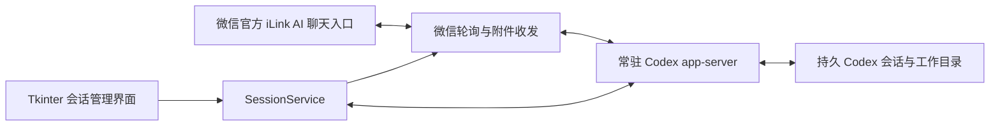

# 架构与设计

## 模块

| 文件 | 职责 |
| --- | --- |
| `session_manager.py` | 列表、预览、按钮状态、后台工作线程与界面事件队列 |
| `manager_core.py` | app-server 初始化、会话列表/创建/接管、配置提交、连接状态与生命周期 |
| `bridge_runtime.py` | iLink HTTP 请求、消息处理、附件下载/上传和 Codex 后端协议 |

## 三项关键处理

**会话写入权。** 列表预览不主动恢复会话。接管时通过 `thread/resume` 确认写入权；失败会提示占用，不强行删除写入锁，也不静默切换到新会话。一个管理程序内部共用同一 app-server，避免两个独立后端争用当前会话。

**配置提交。** 只有接管或创建成功才更新默认会话和账号映射；保存前检查配置是否被其他程序改动，备份现有配置，使用临时文件替换。双文件提交不构成数据库事务，进程异常和磁盘故障仍是未专项验证的边界。

**长轮询。** 收消息请求期限为 `max(35, poll_timeout_seconds) + 10`，默认 45 秒。它是一次请求的最大等待时间，不是每 45 秒才检查一次消息；服务端可提前返回。停止连接通过事件通知，尽量完成已收到的批次。

## 范围与后续

当前围绕一个配置、一条已接管会话和个人使用场景设计。暂未实现多渠道管理、微信内交互审批、完整多媒体解析、持久发件队列或桌面端与桥接端无缝并发接管。

官方 iLink 提供通信入口，实际 AI 与工具执行能力来自本机 Codex；程序未实现另一个独立模型代理。
